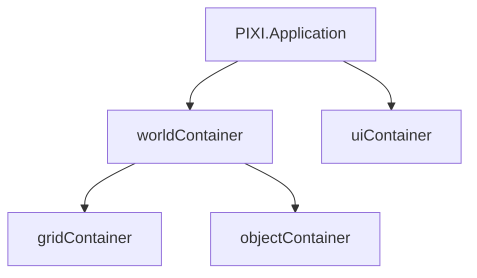
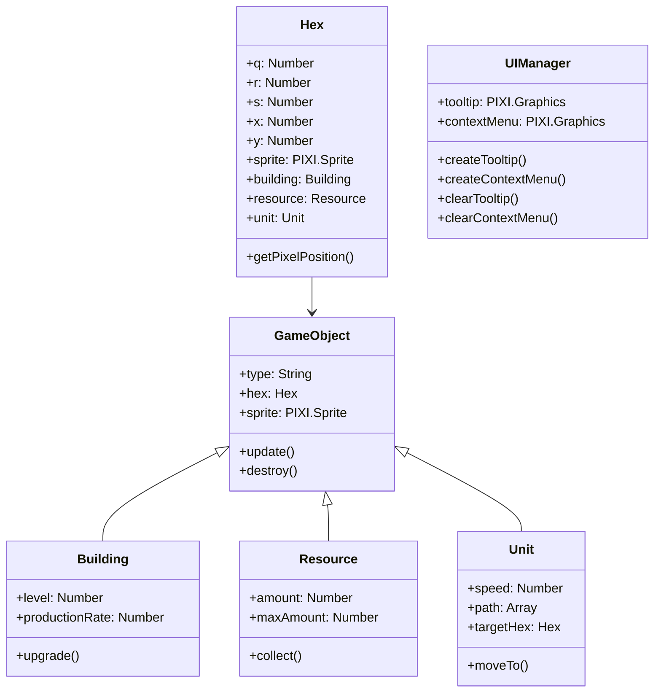
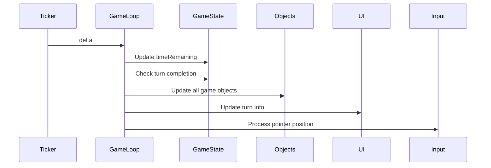

# Hex Grid Game Boilerplate - Technical Specifications

## 1. Overview
The Hex Grid Game Boilerplate is a foundation for building hexagonal grid-based strategy games using PixiJS. It provides core functionality for grid management, game object handling, UI components, and game state management optimized for mobile devices.

## 2. Core Features

### 2.1 Hex Grid System
- **Flat-top hexagons** with axial coordinates (q, r)
- **Dynamic grid generation** with concentric rings
- **Hex sprites**: 32px × 28px (customizable)
- **Centered grid** on screen with automatic repositioning on resize
- **Hex adjacency** with 6-directional navigation
- **Coordinate conversion** between screen, world, and grid spaces

### 2.2 Game Object System
- **Generic GameObject class** with base functionality
- **Specialized classes**:
  - `Building`: Placeable structures with upgrade capability
  - `Resource`: Collectible resources with amount tracking
  - `Unit`: Mobile entities with pathfinding capability
- **Positional binding** to hex grid cells

### 2.3 UI Components
- **Floating tooltips**: Context-sensitive information display
- **Context menus**: Interactive action menus for hex interactions
- **Turn information panel**:
  - Current turn display
  - Turn timer with countdown
  - Visual progress bar
- **Game controls**:
  - Pause/Resume toggle
  - Game speed (1x, 2x, 4x)
  - Zoom controls (+/-)

### 2.4 Game State Management
- **Turn-based progression** with configurable turn duration
- **Game state tracking**:
  - Current turn
  - Time remaining
  - Pause state
  - Game speed
  - Zoom level
- **Resource management** for buildings and resources

## 3. Technical Architecture

### 3.1 Container Structure


- **worldContainer**: Handles grid positioning and centering
- **gridContainer**: Holds hex sprites
- **objectContainer**: Manages game objects (buildings, resources, units)
- **uiContainer**: Contains all UI elements

### 3.2 Coordinate Systems
1. **Screen Coordinates**: Pixel positions relative to viewport
2. **World Coordinates**: Positions relative to worldContainer
3. **Grid Coordinates**: Positions relative to gridContainer
4. **Hex Coordinates**: Axial (q, r) positions

### 3.3 Class Diagram


## 4. Performance Optimization

### 4.1 Rendering
- **Container-based scaling**: Efficient zoom implementation
- **Sprite pooling**: Reuse of sprite objects
- **Selective rendering**: Only update visible elements
- **60 FPS target** on desktop, 30 FPS on mobile

### 4.2 Memory Management
- **Object destruction**: Proper cleanup of unused objects
- **Texture atlas**: Single texture for all sprites
- **JSON metadata**: Efficient animation storage

### 4.3 Mobile Optimization
- **Touch-friendly controls**: Large tap targets
- **Gesture support**: Pinch-to-zoom (future)
- **Performance limits**:
  - Max 50 constructions
  - Max 20 units
  - Max 100 particles

## 5. Input Handling

### 5.1 Interaction States
| State        | Mouse              | Touch               |
|--------------|--------------------|---------------------|
| Hover        | pointerover        | First tap           |
| Select       | click              | Second tap          |
| Context Menu | Right-click (future)| Long press (future) |

### 5.2 Event Handling
- **Pointer tracking**: Global position monitoring
- **Hex selection**: Distance-based hit detection
- **Menu positioning**: Screen boundary awareness

## 6. Game Loop & Timing



- **Turn duration**: Configurable (default: 30 seconds)
- **Time scaling**: Affected by game speed (1x, 2x, 4x)
- **Delta time**: Scaled by game speed for consistent updates

## 7. File Structure

```
/hex-game-boilerplate
│
├── index.html          # Main HTML file
├── main.js             # Core game logic
├── style.css           # UI styles
│
├── assets/             # Game assets
│   ├── hex-grass.png
│   ├── building-reactor.png
│   ├── building-factory.png
│   ├── building-refinery.png
│   └── resource.png
│
├── docs/               # Documentation
│   └── SPECS.md        # This document
│
└── lib/                # External libraries
    └── pixi.js         # PixiJS library
```

## 8. Setup & Configuration

### 8.1 Initialization Parameters
```javascript
const HEX_SIZE = 32;              // Base hex width
const HEX_HEIGHT = 28;            // Hex height
const HEX_SCALE_LEVELS = [1, 1.5, 2, 2.5, 3]; // Zoom levels
const DEFAULT_ZOOM = 2;           // Default zoom level index
const TURN_DURATION = 30;         // Seconds per turn
const GRID_RADIUS = 5;            // Grid size in rings
```

### 8.2 Customization Points
1. **Grid size**: Modify `GRID_RADIUS` in initGame()
2. **Turn duration**: Adjust `timePerTurn` in gameState
3. **Zoom levels**: Modify `HEX_SCALE_LEVELS` array
4. **Visual styling**: Update CSS and sprite assets

## 9. Usage Examples

### 9.1 Adding a New Building Type
```javascript
// In handleHexClick function
menuOptions.push({
    label: 'Build Solar Panel',
    action: () => buildOnHex(hex, 'solar_panel', 'assets/solar-panel.png')
});

// Create specialized class
class SolarPanel extends Building {
    constructor(hex) {
        super('solar_panel', 'assets/solar-panel.png', hex);
        this.energyOutput = 10;
    }
}
```

### 9.2 Implementing Pathfinding
```javascript
// In Unit class
moveTo(targetHex) {
    this.targetHex = targetHex;
    this.path = findPath(this.hex, targetHex);
}

// Pathfinding implementation
function findPath(startHex, endHex) {
    // A* implementation for hexagonal grid
    // ...
}
```

## 10. Performance Metrics

| Metric                  | Target Value       |
|-------------------------|--------------------|
| Initial Load Time       | < 2s               |
| Time to First Render    | < 1s               |
| Memory Usage (Mobile)   | < 100MB            |
| Input Response Time     | < 100ms            |
| Frame Rate (Desktop)    | 60 FPS             |
| Frame Rate (Mobile)     | 30 FPS             |

## 11. Browser Compatibility

| Browser         | Minimum Version |
|-----------------|-----------------|
| Chrome          | 78              |
| Firefox         | 70              |
| Safari          | 14              |
| Edge            | 79              |
| Mobile Chrome   | 78              |
| Mobile Safari   | 14              |

## 12. Future Enhancements
1. **Pathfinding**: A* algorithm implementation for units
2. **Save/Load**: Local storage persistence
3. **Multi-touch**: Pinch-to-zoom gesture support
4. **Animation System**: Sprite animations for interactions
5. **Sound System**: Audio feedback for game events

## 13. Known Issues
1. Context menus may extend beyond screen boundaries on small devices
2. Hex selection accuracy decreases at high zoom levels
3. No built-in pathfinding for units
4. Limited mobile browser testing on older devices

This specification document outlines the technical foundation of the Hex Grid Game Boilerplate, providing a comprehensive reference for developers building upon this framework.